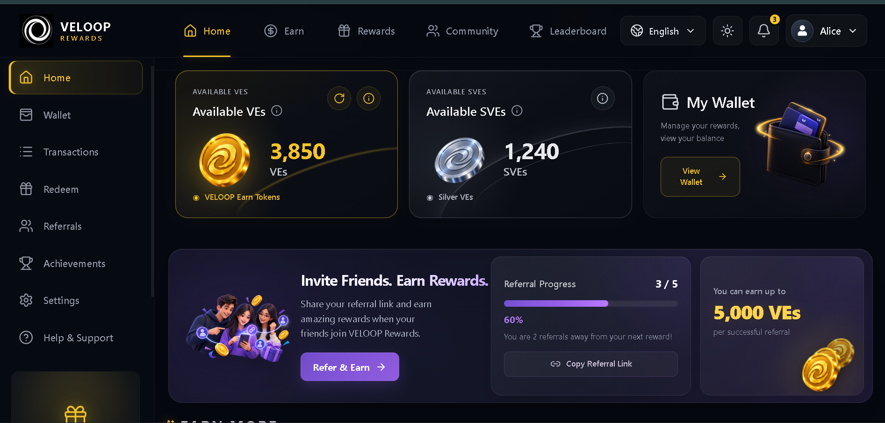
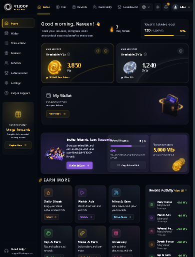
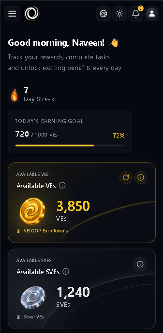

# VELOOP Rewards

A modern rewards dashboard interface built with **React and Vite**, designed for users to track earnings, manage reward balances, discover earning opportunities, participate in campaigns, and monitor account activity.

The project focuses on a **premium dark fintech/rewards experience** with reusable React components, modular CSS, responsive layouts, and a clean component-based architecture.

---

## 📸 Screenshots

### Desktop Dashboard

<!-- Add your desktop screenshot here -->



### Tablet View

<!-- Add your tablet screenshot here -->



### Mobile View

<!-- Add your mobile screenshot here -->



> **Note:** Add your screenshots inside a `screenshots/` folder in the project root and update the filenames above if necessary.

---

## ✨ Overview

VELOOP Rewards provides a centralized dashboard where users can:

* View their VE and SVE balances
* Monitor wallet information
* Track daily earning goals
* Maintain earning streaks
* Discover available earning opportunities
* Participate in referral campaigns
* Monitor recent reward activity
* Earn through social engagement
* Access customer support
* View account security information

The interface is designed around a **dark premium visual system** with subtle glass effects, controlled accent colors, rounded cards, and responsive layouts.

---

# 🚀 Features

## Dashboard

The main dashboard provides a quick overview of the user's reward ecosystem.

### Welcome Header

Displays:

* Personalized greeting
* Current earning streak
* Daily progress
* Earning goal information

---

### Balance Overview

The dashboard provides dedicated cards for:

* VE Balance
* SVE Balance
* Wallet Balance

Each balance component is independently reusable and receives its data through component props/data modules.

---

### Daily Earning Goal

Users can visually track their progress toward their daily earning target.

The component communicates:

* Current progress
* Target amount
* Progress percentage
* Remaining earning potential

---

### Referral Campaign

The referral section allows users to see their referral progress and potential rewards.

Includes:

* Referral progress
* Reward information
* Promotional artwork
* Call-to-action button

---

### Earn More

The **Earn More** section provides multiple earning opportunities through reusable feature cards.

Examples include:

* Mining
* Staking
* Giveaways
* Social activities
* Additional earning features

The section is data-driven, allowing additional earning opportunities to be added without rewriting the component structure.

---

### Recent Activity

The Recent Activity component displays the user's latest reward transactions.

Each activity contains:

* Activity title
* Description
* Reward amount
* Time
* Contextual icon
* Accent state

The activity list is generated from a dedicated data module rather than being hardcoded directly into the UI.

---

### Special Campaign

The campaign component highlights promotional earning opportunities.

Users can view:

* Campaign title
* Campaign description
* Potential reward
* Campaign action

---

### Social Earn

The Social Earn section provides reward opportunities associated with social engagement.

Examples include:

* Following VELOOP
* Joining the community
* Sharing VELOOP

Each action includes a reward amount and interactive UI feedback.

---

### Support

The Support Card provides users with a direct path to customer assistance.

Includes:

* Support information
* Support email
* Contact Support action
* Responsive layout for smaller screens

---

### Security Notice

The dashboard includes a dedicated security notice reminding users to protect:

* Passwords
* OTP codes
* Account information

A visual security status reinforces the protected-account messaging.

---

# 🛠️ Tech Stack

| Technology            | Purpose                                         |
| --------------------- | ----------------------------------------------- |
| **React**             | UI development and component architecture       |
| **Vite**              | Development server and production build tooling |
| **JavaScript (ES6+)** | Application logic                               |
| **Bootstrap 5**       | Utility and responsive foundation               |
| **CSS Modules**       | Component-scoped styling                        |
| **Lucide React**      | UI icons                                        |
| **React Hooks**       | Component state and behavior                    |
| **Git**               | Version control                                 |
| **GitHub**            | Source code management                          |

### Styling Approach

The project intentionally uses **CSS Modules** instead of utility-first frameworks.

This provides:

* Component-scoped styles
* Reduced naming conflicts
* Better component maintainability
* Clear separation between JSX and styling
* Reusable responsive rules

> **Tailwind CSS is not used in this project.**

---

# 🏗️ Architecture

The project follows a **component-based React architecture**.

UI responsibilities are separated into:

* Layout components
* Common components
* Feature components
* Page components
* Data modules
* Styling modules

This makes individual dashboard sections independently maintainable and reusable.

---

# 📁 Project Structure

```text
veloop-rewards/
│
├── public/
│   ├── favicon.ico
│   └── assets/
│
├── src/
│   │
│   ├── assets/
│   │   └── images/
│   │       ├── logo/
│   │       │   └── veloop-logo.png
│   │       │
│   │       ├── wallet/
│   │       │   └── wallet.png
│   │       │
│   │       ├── rewards/
│   │       │   ├── ve-coin.png
│   │       │   ├── sve-coin.png
│   │       │   └── reward-box.png
│   │       │
│   │       ├── referrals/
│   │       │   └── referral.png
│   │       │
│   │       ├── dashboard/
│   │       │   ├── mining.png
│   │       │   ├── staking.png
│   │       │   └── giveaway.png
│   │       │
│   │       └── profile/
│   │           └── avatar.png
│   │
│   ├── components/
│   │   │
│   │   ├── layout/
│   │   │   ├── DashboardLayout.jsx
│   │   │   ├── DashboardLayout.module.css
│   │   │   ├── Navbar.jsx
│   │   │   ├── Navbar.module.css
│   │   │   ├── Sidebar.jsx
│   │   │   └── Sidebar.module.css
│   │   │
│   │   ├── common/
│   │   │   ├── Button.jsx
│   │   │   ├── Button.module.css
│   │   │   ├── Card.jsx
│   │   │   ├── Card.module.css
│   │   │   ├── SectionHeader.jsx
│   │   │   ├── SectionHeader.module.css
│   │   │   ├── Tooltip.jsx
│   │   │   └── Tooltip.module.css
│   │   │
│   │   └── home/
│   │       ├── WelcomeHeader.jsx
│   │       ├── WelcomeHeader.module.css
│   │       ├── DayStreak.jsx
│   │       ├── DayStreak.module.css
│   │       ├── EarningGoal.jsx
│   │       ├── EarningGoal.module.css
│   │       ├── BalanceSection.jsx
│   │       ├── BalanceSection.module.css
│   │       ├── VEBalanceCard.jsx
│   │       ├── VEBalanceCard.module.css
│   │       ├── SVEBalanceCard.jsx
│   │       ├── SVEBalanceCard.module.css
│   │       ├── WalletCard.jsx
│   │       ├── WalletCard.module.css
│   │       ├── ReferralBanner.jsx
│   │       ├── ReferralBanner.module.css
│   │       ├── EarnMore.jsx
│   │       ├── EarnMore.module.css
│   │       ├── FeatureCard.jsx
│   │       ├── FeatureCard.module.css
│   │       ├── UpcomingFeatures.jsx
│   │       ├── UpcomingFeatures.module.css
│   │       ├── RecentActivity.jsx
│   │       ├── RecentActivity.module.css
│   │       ├── CampaignCard.jsx
│   │       ├── CampaignCard.module.css
│   │       ├── SocialEarn.jsx
│   │       ├── SocialEarn.module.css
│   │       ├── SupportCard.jsx
│   │       ├── SupportCard.module.css
│   │       ├── SecurityNotice.jsx
│   │       └── SecurityNotice.module.css
│   │
│   ├── pages/
│   │   └── Home/
│   │       ├── Home.jsx
│   │       └── Home.module.css
│   │
│   ├── data/
│   │   ├── userData.js
│   │   ├── balanceData.js
│   │   ├── featureData.js
│   │   ├── activityData.js
│   │   └── navigationData.js
│   │
│   ├── hooks/
│   │
│   ├── routes/
│   │
│   ├── styles/
│   │
│   ├── App.jsx
│   └── main.jsx
│
├── screenshots/
│   ├── dashboard-desktop.png
│   ├── dashboard-tablet.png
│   └── dashboard-mobile.png
│
├── package.json
├── vite.config.js
└── README.md
```

---

# 🧩 Component Architecture

The dashboard is divided into three primary component categories.

## Layout Components

Responsible for the overall application shell.

```text
DashboardLayout
├── Navbar
├── Sidebar
└── Main Content
```

These components control:

* Navigation
* Sidebar
* Page structure
* Dashboard viewport layout

---

## Common Components

Reusable UI components shared across dashboard sections.

Examples:

```text
Button
Card
SectionHeader
Tooltip
```

These components reduce duplication and provide a consistent design system.

---

## Home Components

Feature-specific components used by the dashboard.

```text
WelcomeHeader
BalanceSection
ReferralBanner
EarnMore
RecentActivity
CampaignCard
SocialEarn
SupportCard
SecurityNotice
```

Each section has its own JSX and CSS Module.

---

# 📊 Data Architecture

Dashboard data is separated from presentation logic.

Example:

```text
src/data/
├── userData.js
├── balanceData.js
├── featureData.js
├── activityData.js
└── navigationData.js
```

This allows UI components to focus on rendering rather than storing large amounts of static data.

For example, earning features can be extended by adding objects to `featureData.js` without rebuilding the `FeatureCard` component.

---

# 🎨 Design System

VELOOP Rewards follows a dark premium interface style.

### Visual Characteristics

* Dark background
* Subtle glass effects
* Gold reward accents
* Purple secondary accents
* Green positive/reward states
* Soft borders
* Rounded cards
* Minimal shadows
* Controlled gradients
* Responsive spacing

The design intentionally avoids an overly gaming-oriented appearance and focuses on a **clean rewards/fintech dashboard aesthetic**.

---

# 📱 Responsive Design

The dashboard is designed to adapt across:

### Mobile

```text
320px
360px
375px
390px
414px
430px
```

### Tablet

```text
600px
640px
768px
820px
900px
1024px
```

### Laptop

```text
1280px
1366px
1440px
```

### Desktop

```text
1600px
1920px
2560px+
```

Responsive behavior includes:

* Adaptive dashboard grids
* Mobile-friendly navigation
* Responsive cards
* Flexible typography
* Fluid spacing
* Responsive images
* Stacked mobile sections
* Tablet-specific layouts
* Prevention of horizontal overflow

The desktop layout is preserved while smaller viewport sizes progressively adapt the component structure.

---

# ⚙️ Installation

## Prerequisites

Make sure you have installed:

* Node.js
* npm
* Git

Check your versions:

```bash
node -v
npm -v
git --version
```

---

## Clone the Repository

```bash
git clone <your-repository-url>
```

Navigate into the project:

```bash
cd veloop-rewards
```

Install dependencies:

```bash
npm install
```

---

# ▶️ Running the Development Server

Start the Vite development server:

```bash
npm run dev
```

The application will be available at the local development URL shown in your terminal.

---

# 🏭 Production Build

Create an optimized production build:

```bash
npm run build
```

Preview the production build locally:

```bash
npm run preview
```

---

# 🔍 Code Quality & Development Practices

The project follows several development practices:

* Component-based architecture
* Reusable UI components
* CSS Modules
* Separation of data and presentation
* Responsive-first considerations
* Semantic HTML
* Reusable icon components
* Consistent naming conventions
* Modular file organization
* Minimal duplication

---

# 🔮 Future Improvements

Potential future development includes:

* Backend API integration
* Real-time reward balances
* Authentication integration
* Transaction history
* Wallet functionality
* Referral tracking
* Campaign management
* Notifications
* User profile management
* Settings functionality
* Real reward redemption
* API-driven activity feeds
* Loading states
* Error states
* Skeleton loaders
* Form validation
* Accessibility improvements
* Automated testing

---

# 🧪 Testing

Future testing coverage can include:

* Component testing
* Responsive UI testing
* Navigation testing
* Form validation testing
* API integration testing
* Cross-browser testing
* Accessibility testing

Recommended tools for future implementation:

* Vitest
* React Testing Library
* Playwright

---

# 🔐 Security Considerations

The current project is primarily a frontend dashboard interface.

When backend functionality is introduced, additional security measures should include:

* Secure authentication
* HTTP-only cookies where appropriate
* Proper authorization
* Server-side validation
* API input validation
* Rate limiting
* Secure password handling
* OTP security
* CSRF protection where applicable
* Secure API communication
* Environment variable management

Sensitive credentials should never be committed to the repository.

---

# 🌐 Browser Support

The interface is intended for modern browsers supporting current JavaScript, CSS, and React features.

Recommended browsers:

* Google Chrome
* Microsoft Edge
* Mozilla Firefox
* Safari

---

# 📌 Project Status

**Current Status:** Frontend Dashboard Development

The primary dashboard interface and responsive UI system are being developed using reusable React components and modular CSS.

---

# 👩‍💻 Author

**Sana Parveen**

BS Computer Science Student
Riphah International University

### Profiles

* GitHub: `SANAPARVEEN-cmd`
* LinkedIn: `sanaparveen89`

---

# 📄 License

This project is currently intended for development, learning, and portfolio purposes.

Add an appropriate open-source license if the repository is intended to be publicly distributed.

---

## ⭐ Acknowledgements

Built with:

* React
* Vite
* Bootstrap
* Lucide React
* CSS Modules

---

<p align="center">
  Built with React ⚛️
</p>
